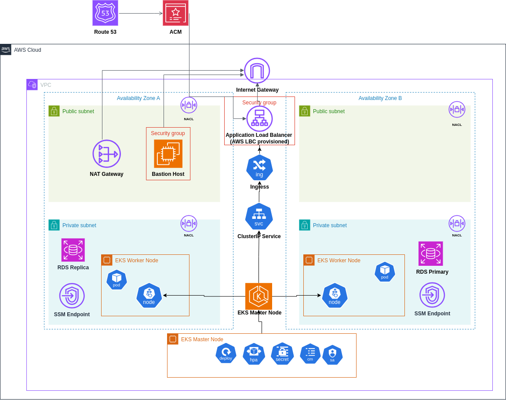
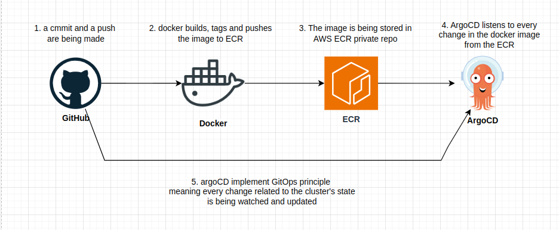
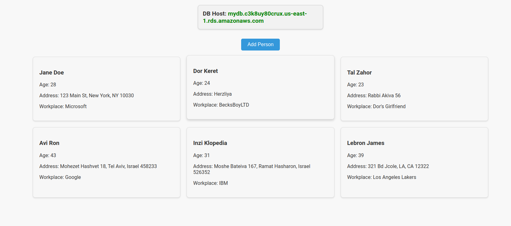
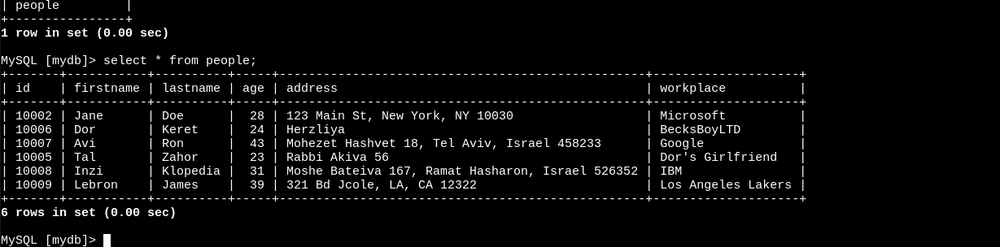
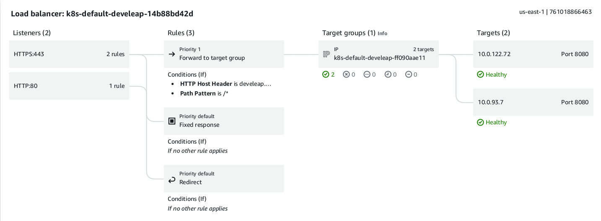
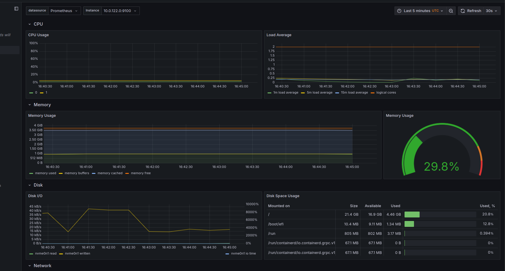
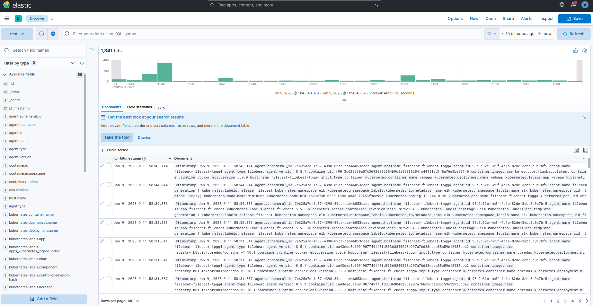
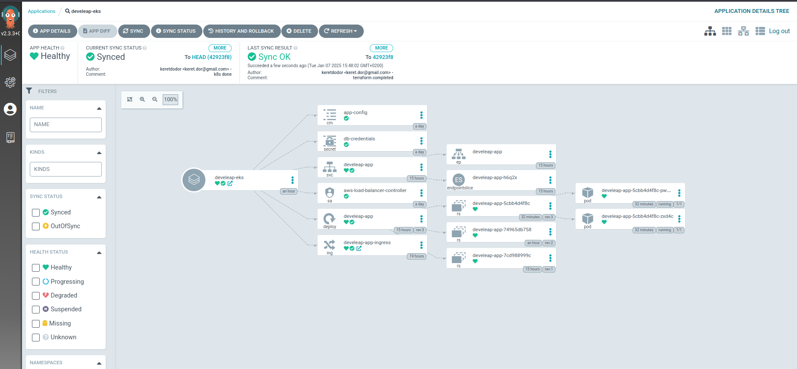

# Infrastructure and CI/CD Implementation




## Local Development Environment - Docker Compose

For local testing and development, I've created a Docker Compose setup that mirrors the production environment while staying developer-friendly. The configuration handles all necessary service dependencies and health checks automatically.


* Application Container
    Running on Python 3.10-slim, optimized for production with minimal attack surface and secure configurations.

* Database Container
    MySQL implementation with health monitoring and secure credential management.

### Local Testing

Run the application locally with:

```bash
docker-compose up --build
```

### CI Pipeline
### Security Implementation

I've implemented a dedicated IAM user with a custom role following the principle of least privilege. This role is specifically designed to allow GitHub Actions to interact only with my private ECR repository, ensuring minimal exposure of AWS resources.

The GitHub Actions pipeline includes:

* Automated builds triggered by code changes to a specific directory
* Secure secret management and IAM authentication
* Build caching for optimization



# AWS Infrastructure with EKS, RDS, and VPC using Terraform

Terraform configurations are for deploying a comprehensive AWS infrastructure that includes an Amazon Elastic Kubernetes Service (EKS) cluster, RDS database, and the necessary networking components.

I've decided to split my work into modules, each module responsible for a different part of the architucture aking it more readable and better logically structured.

The infrastructure is designed with a focus on security, scalability, and best practices. It implements a multi-tier architecture with the following key components

### State Management
The Terraform state is stored remotely in an S3 bucket with versioning enabled, ensuring team collaboration and state history preservation:
- Bucket: `eks-bucket-with-respect-us`
- Key: `tfstate.json`
- Region: `us-east-1`

### DNS and SSL Configuration
- Created a Route53 Hosted Zone for domain management
- Generated an ACM certificate for secure HTTPS access
- Configured DNS records to point to the ALB
- Implemented automatic SSL/TLS termination at the ALB level

## Detailed Module Structure:

## 1. Network Module
The network module (`./modules/network`) creates the foundational networking infrastructure.

#### Key Components:
- **VPC Configuration**:
  - CIDR: 10.0.0.0/16
  - DNS hostnames enabled
  - DNS support enabled

- **Subnet Layout**:
  - Public Subnets:
    - CIDR: 10.0.0.0/19 (AZ-1)
    - CIDR: 10.0.32.0/19 (AZ-2)
    - Auto-assign public IPs enabled
  - Private Subnets:
    - CIDR: 10.0.64.0/19 (AZ-1)
    - CIDR: 10.0.96.0/19 (AZ-2)

- **NAT Gateway**:
  - Deployed in public subnet
  - Elastic IP attached
  - Routes from private subnets

- **VPC Endpoints**:
  - SSM endpoint
  - EC2Messages endpoint
  - SSMMessages endpoint
  - All endpoints in private subnets

- **Bastion Host**:
  - Located in public subnet
  - Custom security group
  - SSH key pair authentication

## 2. EKS Module
The EKS module (`./modules/eks`) manages the Kubernetes cluster and related resources.

#### Key Components:
- **EKS Cluster**:
  - API server endpoint in private subnets
  - Custom security groups

- **Node Groups**:
  - Private node group
  - ON_DEMAND capacity type
  - Instance type: t3a.medium
  - Auto-scaling configuration:
    - Minimum: 2 nodes
    - Maximum: 4 nodes
    - Desired: 2 nodes

- **Add-ons and Helm Packages**:
  - AWS Load Balancer Controller (v1.7.2)
  - Pod Identity Agent (v1.3.4)
  - ArgoCD (v4.5.2)

- **IAM Configuration**:
  - Cluster IAM role
  - Node group IAM role
  - Load Balancer Controller role
  - Service accounts with IRSA

## 3. RDS Module
The RDS module (`./modules/rds`) handles database infrastructure and initialization.

#### Key Components:
- **RDS Instance**:
  - Engine: MySQL 8.0.39
  - Instance Class: db.t3.micro
  - Storage: 20GB GP2
  - Automated backups enabled
  - Multi-AZ: Disabled (can be enabled for production)


- **Initialization Process**:

To initialize the database, I needed to run the init.sql script inside the RDS mysql database and here is how I did it:

  - Copied the init script into a S3 bucket for internal region usage.
  - Created an EC2 for intializing the script inside of it.
  - Created an IAM roles focusing on the least privilege principle allowing the instance to retrieve files from the S3 Bucket.
  - Automated SQL script execution by running bash script.
  

- **Security**:
  - Custom security group
  - Private subnet placement
  - Encrypted storage
  - Network isolation

## Security Configurations

### Network Security
- **VPC Flow Logs**: Available but commented out
- **Network ACLs**: Template provided (currently using default)
- **Security Groups**: Principle of least privilege
- **Subnet Isolation**: Public/Private separation

### Access Security
- **IAM Roles**: Minimal required permissions
- **Key Pairs**: 
  - bastion-key
  - eks-key
  - init_runner_key

### Data Security
- **RDS Encryption**: At rest encryption
- **VPC Endpoints**: Secure AWS service access
- **Private Subnets**: Protected resource placement

# Kubernetes Application Deployment


### Application Architecture

I've structured my core application as a containerized service deployed on my EKS cluster. I store my container image in ECR, and I've configured the deployment to maintain high availability through multiple replicas. The application connects to my RDS MySQL database, which I provisioned in the private subnets of my VPC.



what the database looks like after inserting new data into it:


### Deployment Configuration

In my deployment strategy, I've focused on ensuring application reliability and efficient resource utilization. I maintain two replicas by default, with the ability to scale based on CPU utilization. I've implemented resource quotas to ensure efficient cluster utilization:

```yaml
resources:
  requests:
    memory: "64Mi"
    cpu: "50m"
  limits:
    memory: "128Mi"
    cpu: "100m"
```

For automatic scaling, I've set up a Horizontal Pod Autoscaler configured to:
- Scale based on CPU utilization (target: 60%)
- Maintain between 2 and 10 replicas
- Scale gradually to prevent sudden resource spikes

### Health Monitoring

I monitor application health through a liveness probe that checks the `/health` endpoint every 20 seconds. I've set an initial delay of 15 seconds to allow for proper application startup:

```yaml
livenessProbe:
  httpGet:
    path: /health
    port: 8080
  initialDelaySeconds: 15
  periodSeconds: 20
```

## Configuration Management

### Environment Configuration
I manage my application configuration through a ConfigMap that provides essential environment variables:
- Database host information
- Database name
- Backend service URL

I've kept my configuration separate from the application code, which allows me to make easy environment-specific adjustments.

### Sensitive Data Management
I handle sensitive information such as database credentials through Kubernetes Secrets. I pass these credentials to the application as environment variables, ensuring secure access to the RDS instance I created in my infrastructure.

## Network Configuration

### Service Exposure
I expose my application internally through a ClusterIP service that maps port 80 to the container's port 8080. This service acts as a stable internal endpoint for my application.

### External Access
I manage external access through an AWS Application Load Balancer, configured via an Ingress resource. I've configured the ALB with:
- SSL termination using an ACM certificate
- Automatic HTTP to HTTPS redirection
- Health checks on port 8080
- Public facing access through the domain: orpak.meltachot.site

My Ingress configuration leverages the AWS Load Balancer Controller I installed in my EKS cluster during the infrastructure setup phase.



## Deployment Process

To deploy the application, I follow these steps:

1. First, I apply the configuration and secrets:
```bash
kubectl apply -f configmap.yml
kubectl apply -f secret.yml
```

2. I deploy the main application:
```bash
kubectl apply -f depl.yml
```

3. I create the service:
```bash
kubectl apply -f service.yml
```

4. Finally, I configure external access:
```bash
kubectl apply -f ingress.yml
```

## Monitoring and Maintenance

I can monitor my application through:
- EKS cluster metrics
- ALB access logs
- Application logs accessible via:
```bash
kubectl logs -f deployment/flask-app
```

In my regular maintenance, I:
- Monitor pod health and scaling events
- Review application logs for errors
- Check ALB metrics for request patterns
- Verify database connectivity

## Integration with Infrastructure

My Kubernetes deployment integrates seamlessly with my infrastructure:
- Pods run in the private subnets I created in my VPC configuration
- I secure database access through VPC security groups
- I automate load balancer provisioning through the AWS Load Balancer Controller
- I handle SSL certificate management through ACM integration


# Prometheus and Grafana

I've installed Promehteus and Grafana using Helm's kube-promehteus-stack that includes Prometheus operator and Grafana. It gives us a clear view on node level monitoring, I've used `kubectl port-forward` command to enter Grafana's dashboard. 



# ELK Stack (Elasticsearch and Kibana)

I've deployed the ELK stack using the official Elastic Helm charts to handle log aggregation and visualization. The stack provides comprehensive logging capabilities with Elasticsearch as the search and analytics engine, Logstash for log processing, and Kibana for visualization.



# Helm Package Implementation - Bonus Part

I've packaged my Kubernetes deployment using Helm for easier management. My setup includes:

* A central `values.yaml` containing all configurations
* Templates for deployment, service, ingress, secrets, and configmap
* Helper templates in `_helpers.tpl` for consistent labeling
* AWS ALB ingress configuration for external access

I created separate template files for each Kubernetes resource to maintain a clean structure, with all configurable values centralized in the values file. This modular approach allows me to manage my application's configuration and sensitive data through a single source while enabling easy deployment across different environments.

# ArgoCD and GitHub Integration - Bonus Part

I've implemented GitOps practices in my infrastructure using ArgoCD, which I installed via Helm during my Terraform infrastructure deployment. Since my GitHub repository is private, I needed to set up proper authentication. Here's how I integrated them:

1. After ArgoCD was deployed via Helm, I accessed the ArgoCD UI through port-forwarding:
```bash
kubectl port-forward svc/argocd-server -n argocd 8080:80
```

2. I created a GitHub personal access token with the necessary repository access permissions.

3. In the ArgoCD UI, I went to Settings -> Repositories and connected my private GitHub repository using the token for authentication.

This simple but secure setup allows me to:
* Manage my private repository access securely
* Use the ArgoCD UI to visualize and manage my deployments
* Implement GitOps practices for my application deployment



# Another part - Prometheus and Grafana

I've installed Promehteus and Grafana using Helm's kube-promehteus-stack that includes Prometheus operator and Grafana. It gives us a clear view on node level monitoring, I've used `kubectl port-forward` command to enter Grafana's dashboard. 


